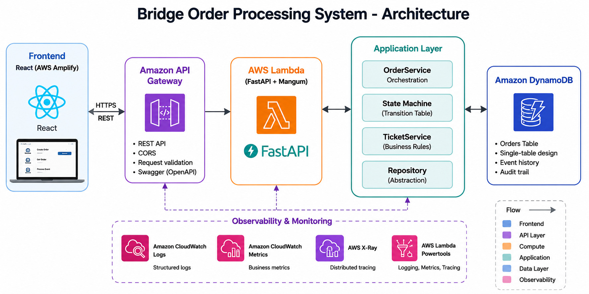
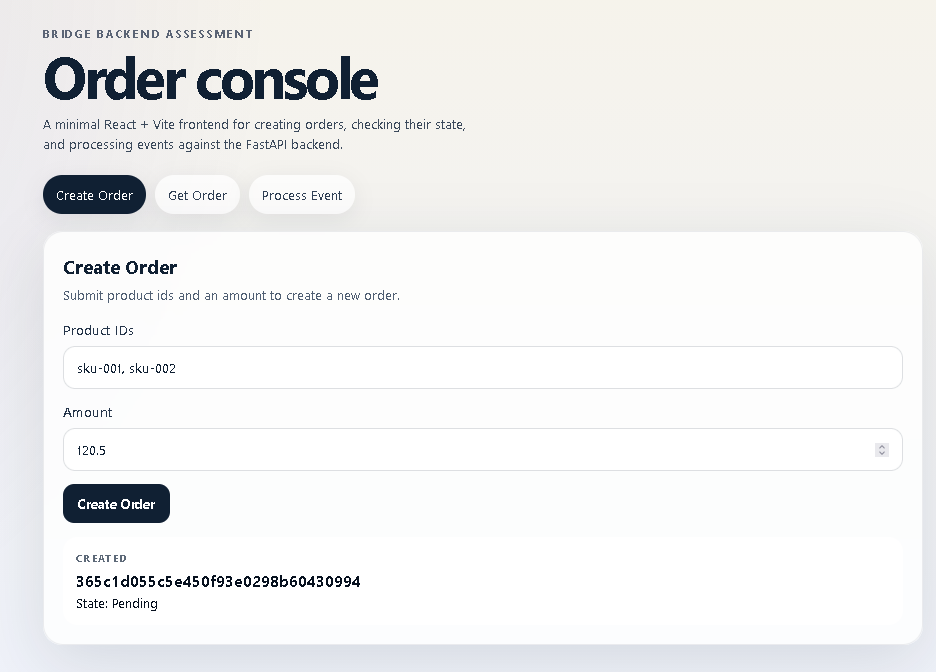
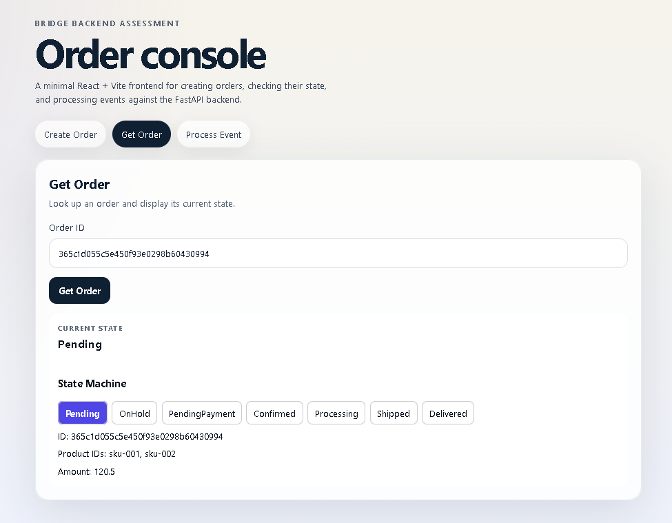
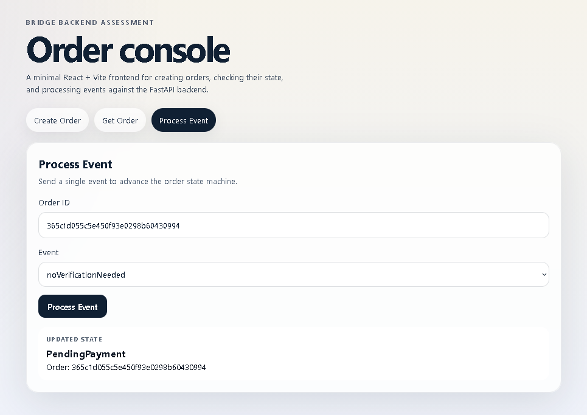
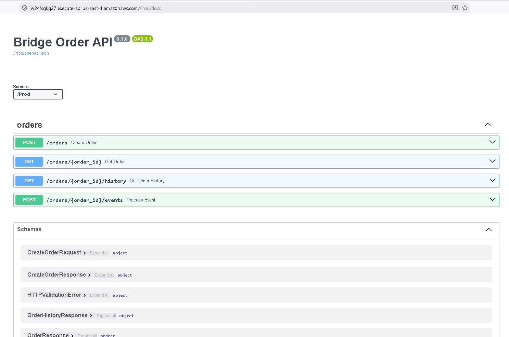
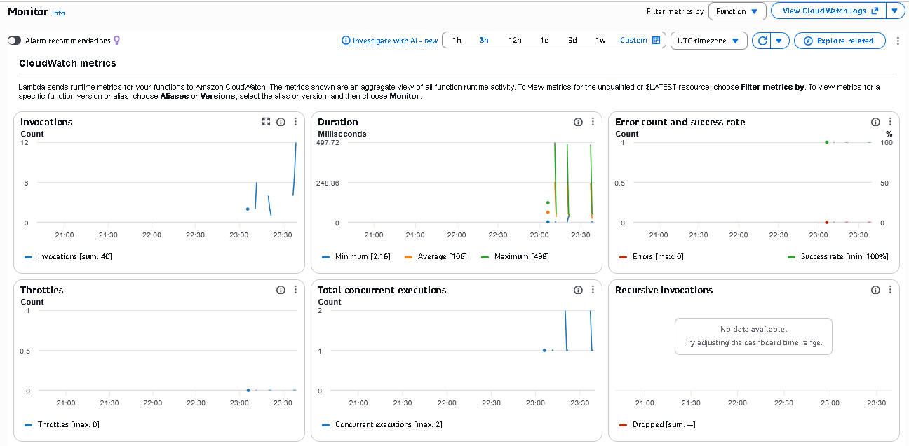
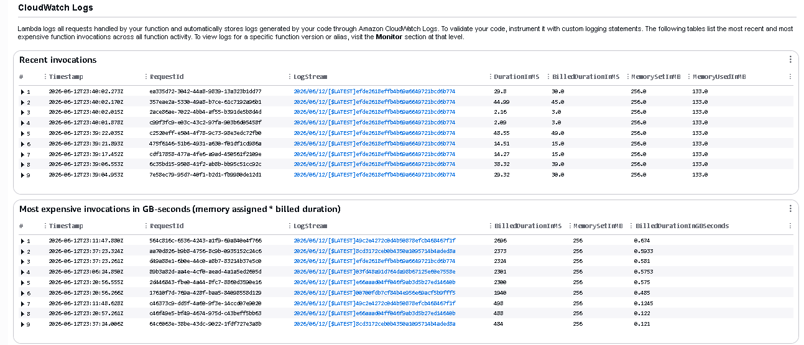

# Bridge Order Processing System

A serverless order processing system that models the complete lifecycle of an order using a State Machine architecture.

The solution was implemented in Python using FastAPI and deployed to AWS using a fully serverless architecture based on API Gateway, Lambda, DynamoDB, and AWS SAM.

## Live Deployment

### Frontend

https://main.d32hexwtvl9soy.amplifyapp.com/

### Swagger / OpenAPI

https://w24fsgkq27.execute-api.us-east-1.amazonaws.com/Prod/docs

### API Base URL

https://w24fsgkq27.execute-api.us-east-1.amazonaws.com/Prod

---

# Architecture



The application follows a layered architecture with clear separation between domain logic, application services, infrastructure concerns, and API boundaries.

The State Machine remains independent from FastAPI, AWS services, and persistence implementations, allowing business rules to evolve without affecting infrastructure components.

## Core Concepts

### State Machine

The order workflow is implemented using a transition-table state machine.

The State Machine is responsible only for determining valid transitions between states.

Business rules remain outside the State Machine and are orchestrated by the application layer.

### Repository Pattern

Persistence concerns are isolated behind repository abstractions.

Two implementations are available:

* InMemoryOrderRepository
* DynamoDbOrderRepository

The application can switch between them through configuration without changing business logic.

### Order Event History

The optional event-history feature was implemented.

Each successful transition records:

* Event type
* Previous state
* New state
* Timestamp

History is stored within the same DynamoDB order item and exposed through:

```bash
GET /orders/{order_id}/history
```

The history endpoint provides a lightweight audit trail of the order lifecycle.

This information is persisted in the same DynamoDB item to avoid introducing additional AWS resources while maintaining full traceability of state changes.

---

# Frontend Demonstration

A minimal React + Vite frontend was implemented as a bonus feature.

The frontend focuses on API consumption rather than frontend architecture and provides a simple interface for interacting with the deployed backend.

Features available:

* Create orders
* Retrieve orders
* Process workflow events
* Visualize order event history
* Visualize the current state within the order state machine

### Create Order



### Get Order and Event History



### Process Event



---

# API Documentation

FastAPI automatically generates an OpenAPI specification and interactive Swagger UI.

Available endpoints include:

* POST /orders
* GET /orders/{order_id}
* POST /orders/{order_id}/events
* GET /orders/{order_id}/history

The live Swagger documentation is available at:

https://w24fsgkq27.execute-api.us-east-1.amazonaws.com/Prod/docs



---

# AWS Deployment

The solution is deployed using:

* AWS Lambda
* API Gateway
* DynamoDB
* CloudWatch Logs
* CloudWatch Metrics
* AWS X-Ray
* AWS SAM
* AWS Amplify

Infrastructure is defined as code using AWS SAM.

The backend is deployed as a Lambda function behind API Gateway, while the frontend is hosted using AWS Amplify.

---

# Observability

AWS Lambda Powertools was added to provide:

* Structured logging
* Distributed tracing
* Business metrics

Metrics include:

* OrdersCreated
* EventsProcessed
* InvalidTransitions
* SupportReviewTicketsCreated

CloudWatch Logs provide an operational audit trail for all order processing activities.

CloudWatch dashboards were used to validate runtime behavior during deployment and manual testing.

### CloudWatch Metrics



### CloudWatch Logs



---

# Running Locally

## Backend

Install dependencies:

```bash
pip install -r requirements.txt
```

Run FastAPI:

```bash
uvicorn app.main:app --reload
```

Swagger:


http://127.0.0.1:8000/docs

---

## Frontend

Navigate to:

```bash
cd frontend
```

Create a `.env` file:

```env
VITE_API_BASE_URL=http://127.0.0.1:8000
```

Install dependencies:

```bash
npm install
```

Run:

```bash
npm run dev
```
The production deployment uses the same configuration mechanism through environment variables in AWS Amplify, allowing the frontend to be deployed against different API environments without code changes.

---

# Testing

Run all tests:

```bash
pytest
```

The test suite covers:

* State Machine transitions
* OrderService orchestration
* FastAPI endpoints
* DynamoDB repository behavior
* Event history functionality

The final solution includes automated coverage across the domain, application, API, and persistence layers.

---

# AI-Assisted Development

This project was developed using an AI-assisted workflow.

Rather than generating code without context, every implementation request was preceded by the same product context document to ensure architectural consistency throughout the project.

Human review was performed after every iteration before accepting generated changes.

Two documents are included in the repository:

## AI_CONTEXT.md

Defines:

* Product requirements
* Architectural constraints
* Business rules
* State machine behavior
* Implementation expectations

This document was provided to the AI before each implementation iteration to ensure consistency and alignment with the assessment requirements.

## DEVELOPMENT_TIMELINE.md

Documents the complete development process.

For every iteration it records:

* Objective
* Prompt summary
* AI-generated output
* Human review
* Corrections applied
* Verification performed
* Architectural decisions

This provides a transparent audit trail of how AI was used during development and how human review guided the final implementation.

---

# Design Principles

The implementation prioritizes:

* KISS (Keep It Simple, Stupid)
* SOLID principles
* Clear separation of concerns
* Dependency inversion
* Infrastructure isolation
* Testability
* Maintainability

The goal was to produce a solution that is easy to reason about, easy to extend, and straightforward to deploy.
